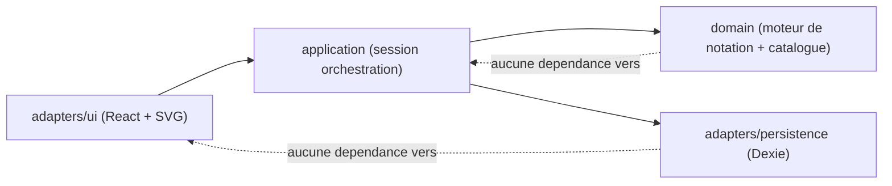
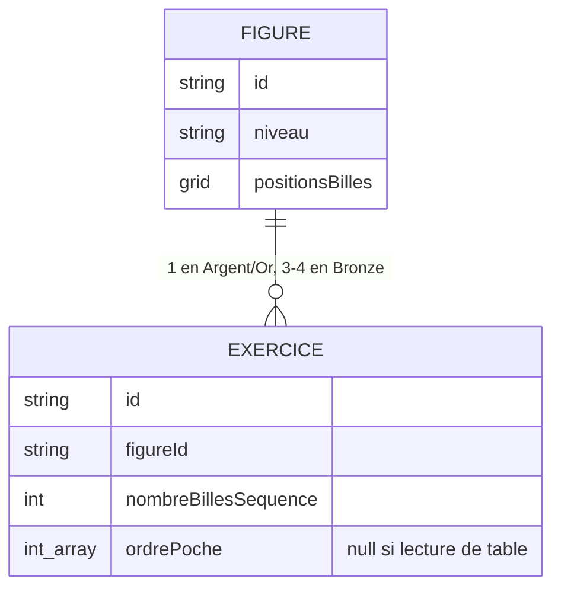
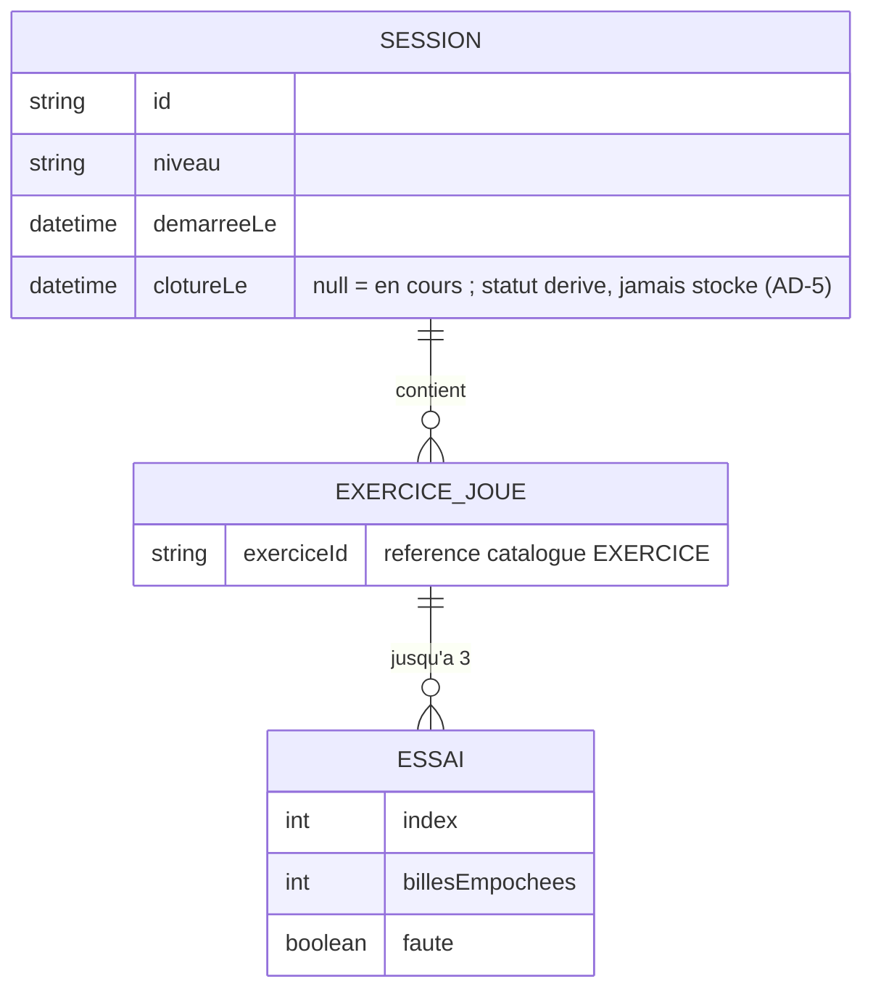

# Architecture Spine — Carnet de Score Blackball DFA

## Design Paradigm

**Layered domain-core.** Trois couches, sens de dependance strict UI → application → domain :

- **domain/** — moteur de notation et catalogue de contenu des 35 exercices. Fonctions pures, aucune I/O, aucun import de React ni de Dexie.
- **application/** — orchestration de session : état courant (niveau, exercice, essai), transitions, seul point d'accès à la persistance.
- **adapters/** — persistance (Dexie/IndexedDB) et rendu (composants React + SVG). N'importent jamais l'un dans l'autre ; chacun n'est appelé que depuis `application/`.



## Invariants & Rules

### AD-1 — Le score est toujours dérivé, jamais stocké [ADOPTED]

- **Binds:** FR-5, FR-6, FR-7, FR-9, FR-10
- **Prevents:** un score stocké comme champ indépendant qui diverge du résultat du moteur de notation si celui-ci évolue (ex. correction de règle) ; deux écrans (séance en cours vs historique) qui recalculeraient le score chacun à sa façon.
- **Rule:** seules les billes empochées par essai (fait brut) sont persistées. Score d'essai, score d'exercice (meilleur essai), score total et statut de seuil sont toujours calculés par `domain/` à la lecture — jamais écrits en base comme valeur indépendante.

### AD-2 — Les schémas sont un rendu, jamais un asset dessiné

- **Binds:** FR-1, FR-2
- **Prevents:** des images statiques par exercice (35 assets à redessiner à la main) ; une divergence de fidélité entre exercices dessinés par des personnes/passes différentes ; un moteur de score qui déduirait le nombre de billes de la séquence depuis la longueur de `ordrePoche` — faux pour les exercices "lecture de table" (Or A/C/D/F) où `ordrePoche` est vide alors que la séquence compte 3 à 5 billes.
- **Rule:** le catalogue distingue **Figure** (schéma partagé : positions de billes en coordonnées de grille, poches, zone de replacement Or E/F) et **Exercice** (bille/poche ciblée, `ordrePoche: number[] | null` — `null` = aucun ordre prescrit, `nombreBillesSequence: number` — toujours renseigné, y compris quand `ordrePoche` est vide/null). En Bronze une Figure porte 3-4 Exercices partageant le même schéma ; en Argent/Or une Figure = un seul Exercice (glossaire PRD §3). Le composant `table-diagram` ne rend que les données de Figure + la cible de l'Exercice — jamais une image ni un markup spécifique par exercice.

### AD-3 — Persistance incrémentale par essai [ADOPTED]

- **Binds:** NFR "Persistance locale résiliente", FR-4
- **Prevents:** une implémentation qui ne sauvegarde qu'à la clôture de séance/exercice, perdant la progression si le téléphone se verrouille entre deux essais.
- **Rule:** chaque essai soumis (tap bille ou "Faute / fin d'essai") déclenche une écriture Dexie du fait brut avant que l'état UI n'avance. La session en cours dans IndexedDB est la source de vérité pour la reprise — jamais l'état React seul.

### AD-4 — Un seul point de suppression de session en cours [ADOPTED]

- **Binds:** FR-8, NFR "Persistance locale résiliente"
- **Prevents:** un handler de cycle de vie (blur, visibilitychange, mise en arrière-plan) qui supprimerait par erreur une session en cours ; un code de démarrage qui traiterait toute session non close trouvée en base comme une anomalie à nettoyer (un deuxième point de suppression déguisé) ; une lecture littérale du PRD §6.2 ("pas de reprise") qui entrerait en conflit avec EXPERIENCE.md (Foundation), qui résout explicitement ce point : "reprise d'une séance interrompue" (hors scope) désigne la reprise **après un abandon explicite** — pas la simple réouverture d'une session jamais abandonnée.
- **Rule:** la suppression d'une session en cours n'existe que dans le handler de confirmation du bouton "Abandonner" (`abandonnerSession`, cf. Structural Seed — Repository Contract). Toute session non close trouvée au démarrage est présentée via le bandeau de reprise (EXPERIENCE.md) — jamais auto-supprimée. Aucun autre code (lifecycle, visibilité, démontage de composant, démarrage de l'app) ne mute ni ne supprime une session en cours.

### AD-5 — Immutabilité post-clôture au niveau repository [ADOPTED]

- **Binds:** FR-8, FR-11
- **Prevents:** un futur écran (ex. correction rétroactive d'un score) qui violerait FR-11 en appelant une API d'update/delete générique sur une séance déjà close ; deux builders qui divergent sur la forme du contrat de persistance (un objet imbriqué Session→Exercice→Essai renvoyé en un appel vs des getters séparés par entité) et écrivent du code appelant incompatible.
- **Rule:** le statut d'une session n'est jamais un champ stocké — il est dérivé de `clotureLe` (`null` = en cours, sinon = clôturée), cohérent avec AD-1. Le repository de persistance (cf. Structural Seed — Repository Contract) n'expose aucune méthode d'update/delete prenant une session dont `clotureLe` est non-null ; seule `abandonnerSession` peut supprimer, et uniquement une session dont `clotureLe` est `null`.

### AD-6 — Sens de dépendance imposé

- **Binds:** all
- **Prevents:** un composant UI qui interroge Dexie directement (contournant AD-3/AD-4/AD-5), ou une fonction `domain/` qui importe React ou Dexie et devient impossible à tester isolément.
- **Rule:** `domain/` ne dépend de rien d'autre dans le projet. `application/` est le seul appelant de `adapters/persistence`. `adapters/ui` n'importe jamais `adapters/persistence` directement — uniquement `application/`.

### AD-7 — Chemin de base cohérent avec l'hébergement statique

- **Binds:** NFR "Hors-ligne total", déploiement
- **Prevents:** un service worker (`scope`) ou un manifest PWA (`start_url`/`scope`) codé en chemin absolu `/`, qui fonctionne en local (`localhost/`) mais casse sous le sous-chemin GitHub Pages (`https://darken33.github.io/blackball-training/`).
- **Rule:** `base` Vite est configuré au chemin de déploiement réel ; `start_url`/`scope` du manifest (vite-plugin-pwa) en dérivent — jamais codés en dur. Toute référence d'asset passe par la résolution Vite (imports/URLs), jamais un chemin absolu manuel.

## Consistency Conventions

| Concern | Convention |
| --- | --- |
| Identifiants | Figure : `{niveau}-{figure}` (ex. `bronze-a`, `argent-c`, `or-f`). Exercice : `{niveau}-{figure}-{numero}` (ex. `bronze-a-1`..`bronze-a-4`, `argent-c-1`, `or-f-1` — numero toujours 1 en Argent/Or). Stable, clé de catalogue et clé étrangère en persistance. |
| Dates | ISO 8601 (`YYYY-MM-DDTHH:mm:ss`), horodatage à la clôture de séance pour le tri Historique (FR-9) |
| Faits de séance persistés | uniquement des faits bruts par essai (billes empochées, ordre le cas échéant, faute déclarée) — jamais un score pré-calculé (cf AD-1) |
| Chaînes UI | littéraux français en dur, pas de couche i18n (utilisateur unique francophone) |
| Erreurs / bords | une session sans essai valide pour un exercice = score 0 pour cet exercice, jamais une erreur bloquante — cohérent avec l'auto-évaluation solo sans arbitre |

## Stack

| Name | Version |
| --- | --- |
| Vite | 8.2.2 |
| TypeScript | 5.9.3 (scaffold officiel `create-vite` react-ts ; TS 7.0 natif exclu — API programmatique non stabilisée à la date de rédaction) |
| React | 19.2.8 |
| vite-plugin-pwa (Workbox) | 1.3.0 |
| Dexie (IndexedDB) | 4.4.5 |

## Structural Seed

```text
src/
  domain/
    scoring/        # moteur de notation (essai -> score, meilleur essai, total, seuil)
    catalog/         # 35 exercices : donnees de grille, bareme, sequence, ordre de poche
  application/
    session/         # orchestration : etat de seance en cours, transitions, appel persistance
  adapters/
    persistence/      # Dexie : schema, repository (sessions, essais), contrat immuable post-cloture (AD-5)
    ui/
      accueil/         # Accueil + bandeau reprise + selection niveau
      exercice/         # Exercice en cours : table-diagram, essai buttons, score bar
      resume/           # Resume de fin de seance
      historique/        # Liste + detail (lecture seule)
      shared/            # table-diagram (rendu SVG), primitives visuelles DESIGN.md
public/
  manifest.webmanifest
sw: genere par vite-plugin-pwa (Workbox), assets catalogue + code precaches a l'install
```

### Repository Contract (`adapters/persistence`)

Seules ces opérations existent — aucune méthode générique d'update/delete au-delà :

- `getSessionEnCours(): Session | null`
- `demarrerSession(niveau): Session`
- `enregistrerEssai(sessionId, exerciceId, essai: {billesEmpochees, faute}): void` — écrit immédiatement (AD-3)
- `cloturerSession(sessionId): Session` — pose `clotureLe` ; seule transition qui rend la session immuable (AD-5)
- `abandonnerSession(sessionId): void` — supprime la session et ses enfants ; valide uniquement si `clotureLe` est `null` (AD-4, AD-5)
- `listerSessionsTerminees(): Session[]` — uniquement `clotureLe` non-null, triées desc (FR-9)
- `getDetailSession(sessionId): SessionDetail` — session + exercices joués + essais (FR-10)

### Déploiement & Environnements

Un seul environnement (production) : build statique (`vite build`) publié sur GitHub Pages via GitHub Actions, déclenché sur push vers `main`. Pas de backend, pas de staging (outil personnel, faible enjeu). `base` Vite et manifest PWA alignés sur le sous-chemin GitHub Pages (AD-7).





## Capability → Architecture Map

| Capability / Area | Lives in | Governed by |
| --- | --- | --- |
| FR-1, FR-2 (catalogue, schémas) | `domain/catalog`, `adapters/ui/shared` (table-diagram) | AD-2 |
| FR-3, FR-4 (choix niveau, saisie essai) | `application/session`, `adapters/ui/exercice` | AD-3, AD-6 |
| FR-5, FR-6, FR-7 (moteur de score, total en continu) | `domain/scoring` | AD-1, AD-6 |
| FR-8 (clôture, verrouillage) | `application/session`, `adapters/persistence` | AD-4, AD-5 |
| FR-9, FR-10, FR-11 (historique) | `adapters/ui/historique`, `adapters/persistence` | AD-1, AD-5 |
| NFR hors-ligne / déploiement | build Vite, GitHub Actions → GitHub Pages | AD-7 |

## Deferred

- **Multi-utilisateur, comptes, sync cloud** — explicitement hors périmètre (PRD §5), aucune couche d'auth/API à prévoir.
- **CMS / édition de contenu in-app** — catalogue fixe embarqué dans le code, mise à jour uniquement par nouvelle version d'app (PRD §5).
- **Stratégie de test détaillée** (unitaire moteur de notation, e2e PWA offline) — à cadrer via `bmad-testarch` au moment du build, pas structurante pour cette spine.
- **Découpage en epics/stories** — cette spine reste à l'altitude initiative ; le détail par epic (ordre de construction, séquencement des 3 niveaux) revient à `bmad-create-epics-and-stories`.
- **Choix exact du gestionnaire de paquets et de la CI complète** — au-delà du principe "GitHub Actions build+deploy vers GitHub Pages", le détail du workflow YAML est un détail d'implémentation, pas un invariant inter-unités.
